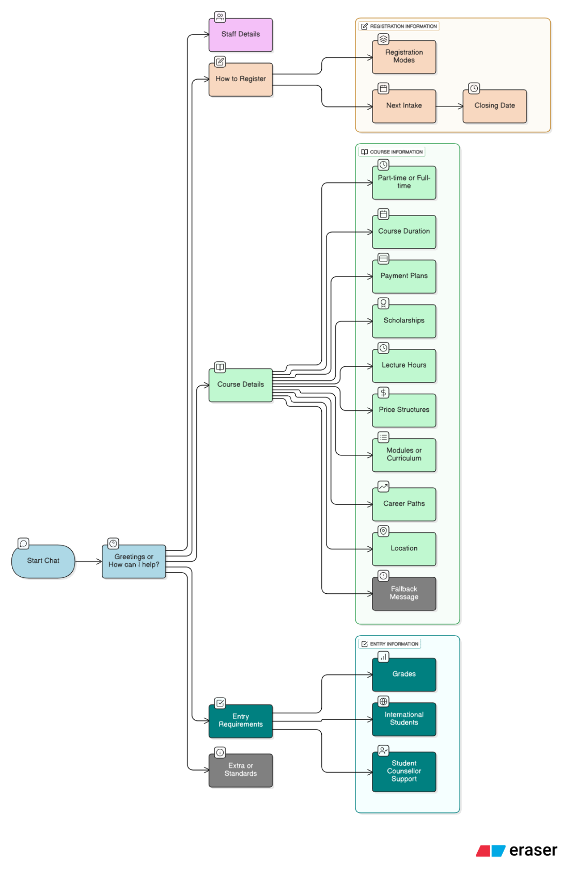
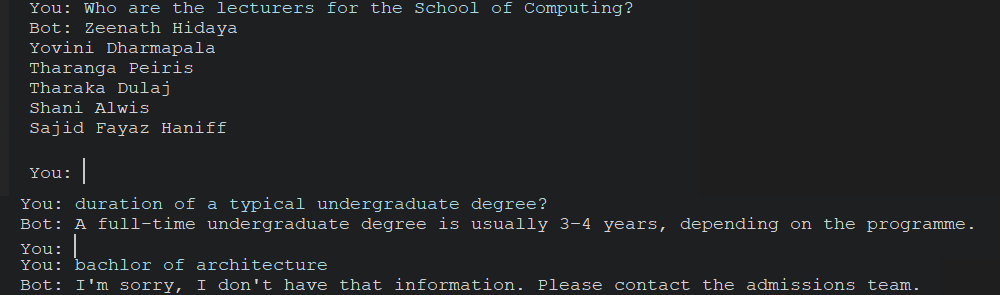

# University Admissions Chatbot (Python, NLTK)

A rule-based chatbot that answers common university admissions questions (programmes, entry requirements, intakes, fees, scholarships, contact details). Built for a first-year Applications of AI module assignment.

## How it works
- **Greetings and small talk:** regular-expression patterns handle messages such as "hello", "help", "thanks" and "bye".
- **NLP preprocessing:** user messages are tokenised with NLTK and each word is reduced to its stem with the Porter stemmer, so "applying" and "apply" are treated the same.
- **Matching:** the stemmed message is compared with every question in the knowledge base using Jaccard similarity, and the best match above a threshold (0.25) is returned.
- **Fallback:** if nothing matches well enough, the bot politely directs the user to the admissions team.

## Conversation map


## Demo


## Tech stack
Python, NLTK (tokenisation, Porter stemmer), regular expressions

## Run locally
```bash
pip install -r requirements.txt
python chatbot.py
```
Type a question, or `quit` to exit.

## What I learned
- Designing a conversation flow and a knowledge base for a real use case
- Basic NLP preprocessing (tokenisation and stemming) and similarity-based matching
- Handling unsupported questions gracefully with a fallback response

## Possible improvements
Use word boundaries in the greeting patterns (so "they" does not trigger "hey"), replace keyword matching with sentence embeddings or an LLM with retrieval (RAG), and add a web interface.
